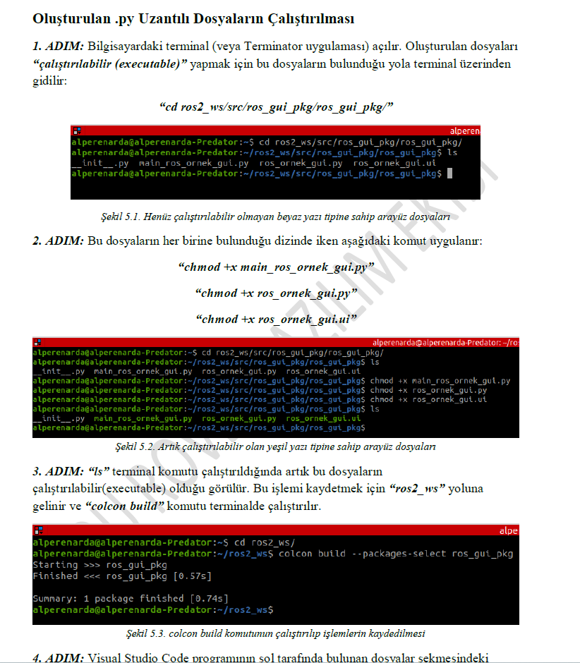

## TUR
# PYQT 6 ile Arayüz Tasarımı ve ROS 2 ile Veri Aktarımı
"PYQT 6 ile Arayüz Tasarımı ve ROS 2 ile Veri Aktarımı" başlıklı bir dokümantasyon hazırladım. Bu çalışmada, KOU ROVER ekibiyle geçtiğimiz yıl boyunca edindiğim bilgiler doğrultusunda, PYQT 6 kullanarak grafiksel kullanıcı arayüzleri tasarlamaya ve ROS 2 ile veri aktarımına odaklandım. Robotik sistemlerde veri yönetimi üzerine yoğunlaştım ve veri işleme ile görselleştirme gibi alanlarda önemli adımlar attım. Bu dokümanın, ilgilenenler için faydalı bir kaynak olmasını umuyorum. Doküman Türkçedir çünkü aslen KOU Rover Takımı'na yeni katılan öğrenciler için hazırladım.

## ENG
# Designing an Interface with PYQT 6 and Data Transfer with ROS2
I prepared documentation titled 'Designing an Interface with PYQT 6 and Data Transfer with ROS 2.' I focused on designing graphical user interfaces with PYQT 6 and data transfer using ROS 2, based on the knowledge I gained over the past year with the KOU ROVER team. I concentrated on data management in robotic systems and took significant steps in areas like data processing and visualization. I hope this will be a useful resource for those interested. This document is Turkish because this is originally for new students from KOU Rover Team.
---

---

---

